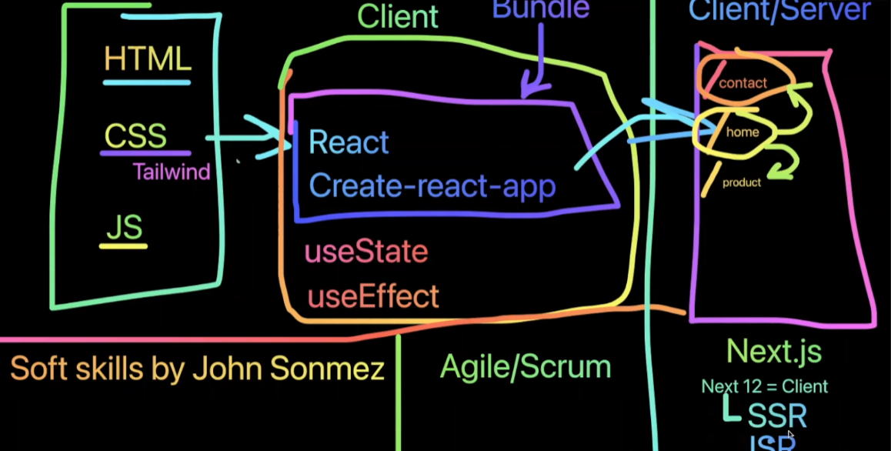

# Web Dev

- HTML (hyper text markup language)

  ```
  1. skeleton
  2. block
  ```

- CSS (Cascading Style Sheets)

  ```
  1. Flex box
  2. https://flexboxfroggy.com
  3. https://cssgridgarden.com/
  ```

- JS (JavaScript)
  ```
  1. Data Structures
  2. String,number,object,array,functions , ES6/7 (ecma standard)
  3. DOM (document object modeling)
  ```

# Extensions you need to install

    ```
    1.  VS code - prettier
    2.  VS Code - live server
    3.  VS code - auto rename Tag
    4.  VS code - Emmet(div>ol>li*10.azim_list)
    ```

# HTML Basics

    ```
    1. Intro to the HTML Document
    2. Tags & Attributes
    3. How to Add HYPERLINKS
    4. Managing IMAGES on WEBPAGES
    5. Create your first list and tables on a site!
    6. introdution to DIVS
    7. Classes
    8. ID's
    9. How to use SPAN & Inline elements
    10. Learn to create your first website FORM !
    11. ACCEPT & Handle user input!
    ```



# CSS Introduction

```
  1. What does CSS stand for
  2. How does Google look like Google
  3. Various use cases of CSS
  4. 3 different ways to add CSS
    a. Inline
    b. Internal
    c. External (Recommended)
  1. Flex box
  2. https://flexboxfroggy.com
  3. https://cssgridgarden.com/
  4. https://www.w3schools.com/css
  5. https://developer.mozilla.org/en-US/docs/Web/CSS

```
