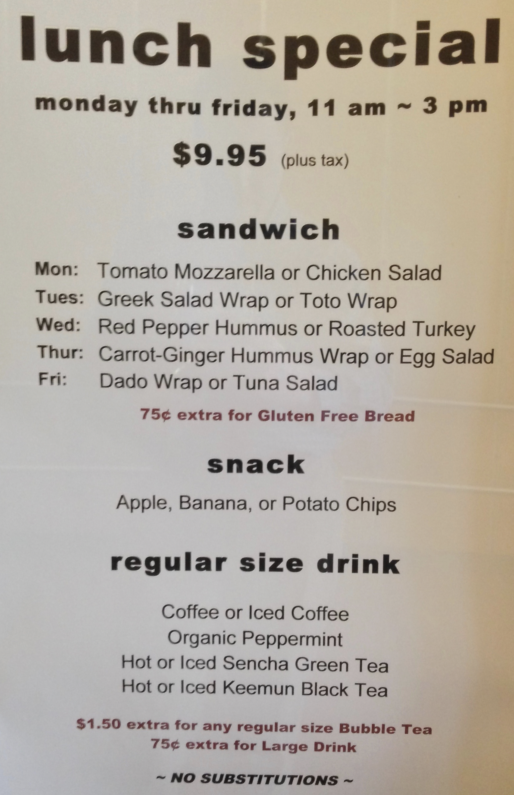
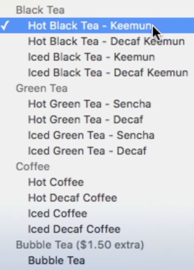
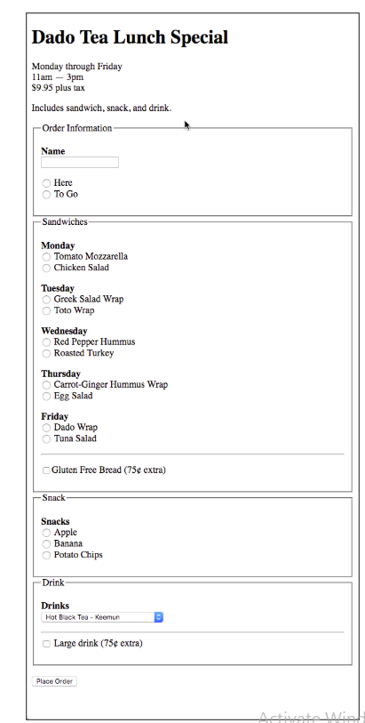

# Intro & Document layout

```
  1. https://www.w3schools.com/html/default.asp
```

# Tags & Attributes

```
  1. Adding Links & Images
```

# List & Tables

```
  1. Create Lists and Tables
    a. ol , ul , dl  (order,unorder, defination <dt><dd>)
    b. <table> <tr> <td> <th> (row, data,header)
    c. Column span
    d. Row Span
    e. thead,tbody,tfoot
    f. colgroup <col />
```

# An Introduction to Divs

```
 1. Block Element <div>
```

# Classes & IDs

```
  1. classes . (represents class)
  2. IDs # (reprsents unique identification )

```

# Span & Inline

```
  1. How are they different to Div or Block element.
  2. <span> tag is used to make sure the content is in the same line
```

# Input & Form Handling

```
  1. Using different input types for text (text, email, tel, password)
  2. Adding a placeholder in the text box
  3. Implementing different types of input options (dropdown, radio, checkbox, file)
  4. GET vs POST
  5. target="_blank" attribute and its uses
  6. How to submit and reset a form

```

# Day-5 Homework : Let's build a Menu Selection Form with HTML

- The HTML Homework Assignment

  1. A well known cafe in the area has asked for your help to build thier menu system online. They need the following menu made as on online form



- Goal

The purpose of this home work is to foucs on creating the different types of form input elements (input text, choose one, choose one choose all that apply, pull-down menu, submit button) - using appropriate name, value and id attributes for them, as well as using the label element to associate text labels with these input elements.

- Any type of javascript integration in the form is not required.

- Hints

  1. Create a label element for all the text, radio, and checkbox input elements
  2. Input Types
     a. Text input for name
     b. Radio buttons for here/to go, sandwich choice, snacks
     c. Checkboxes for gluten free and large drink choices
     d. Pull-down option for drink choices

  3. CHALLENGE: Group drinks as shown in the picture below

  

  4. Your online new slection form should look something like this:

  (This is just for refrence. You don't need to copy the layout exactly)

  

- The cafe requests that the source code is submitted to them for review, once you have done this, - fill this form

```
 https://airtable.com/shrfG9GQtLaKIqYQ2
```

to send the product to the cafe manager!
